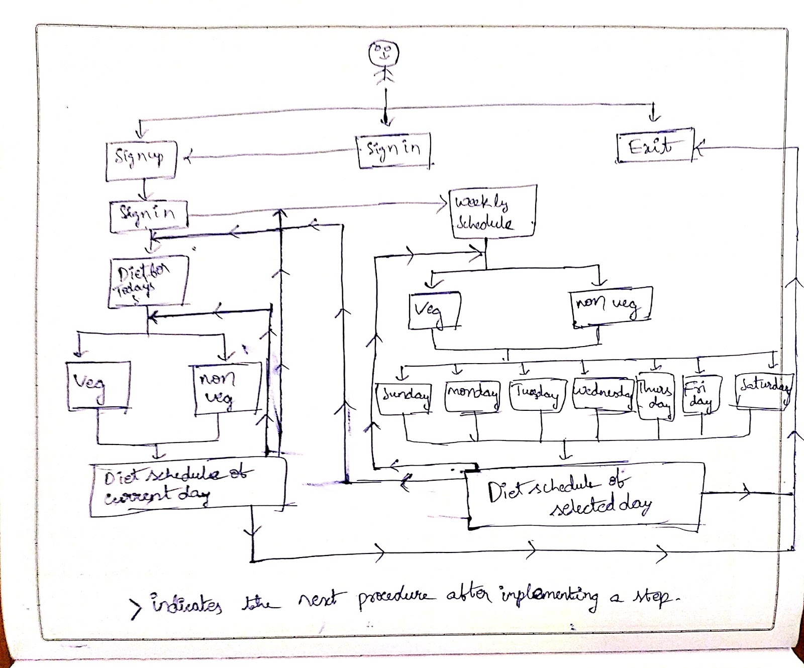

# Diet-Management-System

About- 
    
   The Project “Diet Management System” is the project which gives the diet schedule for the user. It will give both a weekly schedule and even the current day’s schedule and the user can select anything from the above two and can check one’s diet. 
    
    
Methodology-
     
     
   Firstly, The user will be given an option to signup, sign in and exit. If the user selects exit, the program will be ended by displaying “THANK YOU HAVE A GREAT DAY WITH HEALTHY MEAL”, else if selected sign in, it will be asked to sign up and moved to sign up window, and when selected sign up, the information such as username, password, password confirmation, age, gender and contact info will be asked, and the user must enter it. If password and password confirmation doesn’t match, one needs to re-enter again. After successfully sign up, one will be now asked to sign in for moving further where the information of a single user is stored and if username and password don’t match with the info given by the user, it will be asked to log in again. After a successful login, it will be asked to select either a weekly schedule or current day’s schedule. If the user selects, current day schedule, the user will be asked to select for a vegetarian or a non-vegetarian diet, after selecting one’s preference, the day will be automatically calculated as I used some functions from <ctime> library and finally, the diet for the current day will be displayed which will be definitely different from day-to-day. And again after displaying the diet successfully, the user will be again given three options, where in the first option one asked to go back where one will be having the option to select veg or non-veg for the current day and again it repeats, if it is not selected, the second option is to go back to the main menu where one has the option to select either weekly schedule or current day’s schedule, even if the user rejects that, the third option is to exit. Now, if the user selects the weekly schedule instead of the current day’s diet schedule, then it asks to enter whether one needs a vegetarian diet or a non-vegetarian diet. If selected anyone, then it will be given an option to select the day which one wants to check the diet schedule and even by selecting the day, the diet schedule of that selected day will be displayed and given an option to choose to either go back where one will be again asked to select veg or non-veg for the weekly schedule and again it repeats, if it is not selected, the second option is to go back to the main menu where one has the option to select either weekly schedule or current day’s schedule, even if the user rejects that, the third option is to exit. And Finally, if the user selects Exit, the program will stop and displays a thank you note. 

Diagram of the Project-

Input/Output combination-

 
 
 
 

CONCLUSION-
	
   This code will finally provide the diet schedules based on the user’s preference. This can be used by anyone in the globe who wants to be healthy, fit and wills to be healthy, fit. There are many codes which give information regarding exercises, transport mechanisms, etc but there is no code which gives information regarding diet. One can have a proper schedule of diet by using this. One can follow the diet which is given as the output and can get fit as the diet schedules are from the certified trainer. Now-a-days, the days are not so good where many people are suffering with obesity, heart attacks, skin diseases, personality imbalance where so many people will be so thin even though they eat lot, etc as they are out of the diet and because of lack of vitamins, minerals, proteins, etc in their bodies. By using this, they can get back to the perfect physique as they wish. These diets can be even implemented in hostel messes, so that the people who stay in hostels can have a healthy diet. Many doctors suggest to have a healthy diet to the patients, this can create a confusion in patients about the selection of a perfect diet as there are many articles in the internet which suggest diets, so, in order to avoid the confusion in patients, doctors can use this and make their patients to use this so that a particular diet can be followed by both doctors and patients to lead a healthy life. The code, directly, automatically calculates the live time and takes the day which results in the display of the diet schedule of the current day, so that the user can use it and see the diet of the current day, which is most required in this busy life instead of wasting time by going through everyday schedule to reach that particular day’s diet. This diet management system can be used exclusively by doctors, gym trainers, dietitians, Hostel management people, bodybuilders and by many people who wish to be healthy and fit. Everyone can use this as it directly asks the user about the requirements and based on that, the final diet will be given which is time saving. 
